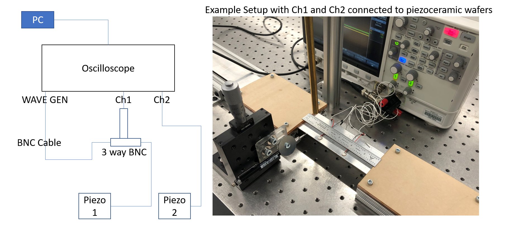
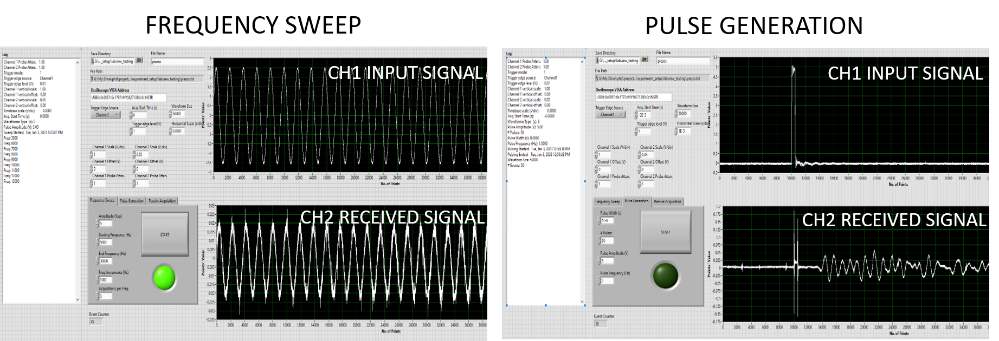
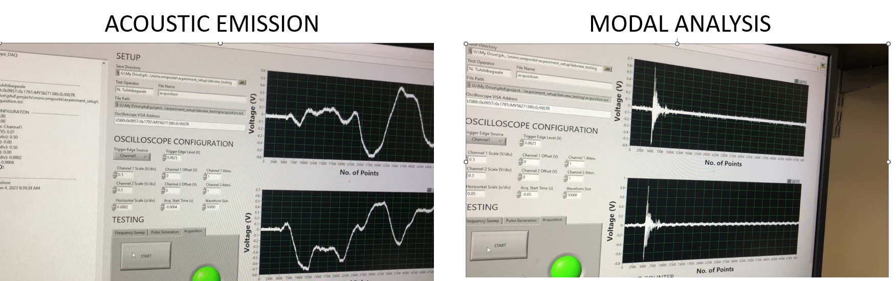

# DalyLab Oscilloscope DAQ

LabVIEW software for automated waveform generation and data acquisition using Keysight InfiniiVision oscilloscopes. The project was developed for ultrasonic testing and acoustic emission experiments in the UCSB Daly Lab.

The LabVIEW application provides three operating modes:
- Frequency sweep
- Pulse generation
- Data acquisition

Python utilities are included for loading, post-processing, and analyzing data generated by the LabVIEW application.

  

  

  

## Repository Contents

### `DalyLab_Oscilloscope_DAQ_v1.0.vi`
Main LabVIEW application (developed in LabVIEW 2017) for oscilloscope control, waveform generation, and data acquisition.

### `store_infiniivision_oscilloscope_data_as_binary.py`
Python utility for storing waveform data acquired from the Keysight InfiniiVision oscilloscope in binary format.

### `load_example_outputs.py`
Example Python script demonstrating how to load and visualize data generated by the LabVIEW application.

### `labview_functions.py`
Collection of Python helper functions for loading, processing, and analyzing experimental datasets.

### `example_outputs/`
Example output files generated by the LabVIEW application.

### `manual.pptx`
Installation guide and user manual describing software setup and operation.

## Contact

For questions or feedback, please contact:

**Nick Tulshibagwale**  
📧 tul725@gmail.com
